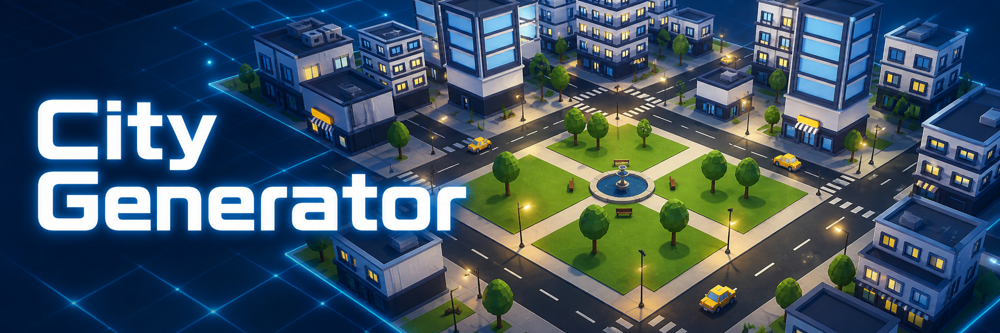

🇬🇧 [Read in English](README.md)

# City Generator



Una herramienta de Editor para Unity que genera proceduralmente una ciudad —
carreteras, aceras, marcas viales, edificios, plazas, mobiliario urbano, semáforos,
tráfico autónomo y peatones— en una escena nueva o existente. Ábrela desde **Tools >
City Generator > Open**.

La ventana está dividida en tres pestañas: **City** (cuadrícula, suelo, edificios,
plazas, vehículos, mobiliario, y Custom Places — lugares colocados a mano: un título,
un prefab, una manzana/esquina elegida en un grid visual, y una orientación fija — que
se instancian en lugar de un edificio aleatorio en esa posición), **Player** (Player
Prefab, movimiento, ajuste del `CharacterController` y de la cámara) y **Pedestrians**
(la lista de prefabs de peatones, además de su comportamiento al caminar/esperar y el
ajuste de la multitud) — todo se edita desde la ventana, sin necesidad de tocar el
código del paquete.

Se distribuye como el package embebido `com.santiandrade.citygenerator`, instalable
directamente desde una git URL, con un conjunto completo de prefabs de demostración
incluido para que la ventana esté lista para generar una ciudad nada más instalarlo.

## Instalación

En tu proyecto de Unity, abre **Window > Package Manager**, pulsa el botón **+**, elige
**Install package from git URL** y pega:

```
https://github.com/santiandrade/Unity-CityGenerator.git?path=/Packages/com.santiandrade.citygenerator
```

El segmento `?path=` apunta al package dentro de este repositorio (la raíz del
repositorio no es en sí misma un package). Esta forma sigue la punta de la rama por
defecto.

Para una instalación reproducible fijada a una versión concreta, añade `#vX.Y.Z` con un
tag de la [página de Releases](https://github.com/santiandrade/Unity-CityGenerator/releases)
— por ejemplo, `...citygenerator#v1.0.1` para esa versión exacta.

## Actualizar

Si instalaste el package **sin** tag `#vX.Y.Z` (siguiendo la punta de la rama por
defecto), Package Manager puede detectar y aplicar la actualización por ti: abre
**Package Manager > tu entrada instalada de "City Generator" > Manage**, y pulsa
**Update** si aparece disponible. Esto vuelve a resolver la git URL y sustituye el commit
fijado en `Packages/packages-lock.json` por lo que haya ahora en la rama por defecto, sin
necesidad de eliminar y reinstalar.

Si la instalaste **con** un tag `#vX.Y.Z` fijado a una versión concreta, Package Manager
no ofrece una actualización automática a un tag nuevo — el botón **Update** solo sigue la
misma referencia con la que instalaste. Para pasar a una versión nueva, reinstala el
package: en **Package Manager**, elimina tu entrada instalada de "City Generator" y
vuelve a instalarla desde la git URL usando el tag nuevo de la
[página de Releases](https://github.com/santiandrade/Unity-CityGenerator/releases).

## Requisitos

- **Unity 6000.0** o superior.
- **El nuevo Input System de Unity** (`com.unity.inputsystem`, declarado como
  dependencia del package). Los `.asmdef` de la herramienta referencian
  `Unity.InputSystem`; la API clásica `UnityEngine.Input` no se usa en ningún sitio.
- **glTFast** (`com.unity.cloud.gltfast`, declarado como dependencia del package).
  Necesario para importar la fuente de demostración, que es un modelo `.glb`.
- Una layer llamada **`Vehicle`**, que usa el tráfico para que los vehículos se
  detecten entre sí con su sensor frontal. No hace falta que la crees tú — la
  herramienta la crea la primera vez que genera tráfico con ella, usando el primer
  slot de layer libre, y avisa por consola de que lo ha hecho. Solo si ya están todos
  los slots de layer ocupados, recurre a avisar en vez de crearla — en ese caso los
  vehículos dejan de detectarse entre sí por completo (siguen parando en semáforos y
  por prioridad en cruces sin semáforo) hasta que liberes un slot.
- Una layer llamada **`Pedestrian`**, con la misma idea: se crea automáticamente la
  primera vez que generas peatones, para que el sensor de peatones de `CarAgent` pueda
  detectarlos. Mismo fallback fail-closed si no queda ningún slot libre — los vehículos
  simplemente no detectan peatones hasta que liberes uno.
- Un prefab `TrafficLight` con un componente `CityGenerator.Runtime.TrafficLight`
  siempre que la rejilla tenga al menos una intersección interior (ancho y alto de
  rejilla ambos mayores que 1) — la herramienta lo valida y bloquea la generación si
  falta, independientemente de si **Include Traffic** está activado: la red de tráfico
  y sus semáforos siempre se generan para que los cruces queden conectados a un
  semáforo real, incluso sin ningún vehículo.

## Contenido de demostración

El package incluye un conjunto completo de assets de demostración bajo su carpeta
`DefaultAssets/` — edificios, vehículos, vegetación, mobiliario urbano, piezas de
suelo, materiales y el prefab del jugador— así que `Tools > City Generator > Open` se abre con
todos los campos obligatorios ya rellenos y una ciudad está a un clic de distancia.

Este contenido de demostración vive dentro del package, que Unity trata como de solo
lectura en tu proyecto. Si quieres modificar un prefab de demostración, cópialo primero
a tu propia carpeta `Assets/` y asigna tu copia en la ventana de la herramienta, en vez
del original del package.

## Requisitos para tus propios prefabs

La herramienta nunca modifica un asset de prefab —todo lo que cambia lo hace sobre las
*instancias de escena* que genera— pero sí espera algunas cosas de lo que le asignes:

- **Pivote en la base**, para cada categoría de prefab (edificios, props, vegetación,
  suelos). La herramienta posiciona todo colocando el pivote en el punto objetivo sobre
  el suelo.
- **Edificios dimensionados al slot de esquina de 22 m**
  (`CityGeneratorConstants.BuildingSlotPitch`). Los edificios son la única categoría que
  la herramienta **no** comprueba contra solapamiento, ni entre sí ni contra el borde
  de la manzana — un prefab de edificio sobredimensionado se solapará visiblemente con
  su vecino. Es deliberado: dimensionar tus propios prefabs al slot es tu
  responsabilidad, igual que con cualquier otro asset proporcionado por el usuario.
- **Vehículos y peatones**: sin `Rigidbody` — ambos se mueven por transform cada frame
  (`CarAgent`/`PedestrianAgent`). No hace falta que añadas tú el collider: el root de la
  instancia generada siempre acaba con un collider propio, sin trigger, dedicado a la
  detección por sensor — si el root ya trae uno se reutiliza, y si no, se añade un
  `BoxCollider` dimensionado a partir de los bounds combinados de los renderers del
  propio prefab. Un collider que solo exista en un hijo de la jerarquía se deja
  completamente intacto (su propia layer e `isTrigger` quedan libres para lo que
  quieras usarlos) — solo el proxy del root es lo que permite a los vehículos
  detectarse entre sí con un `SphereCast` frontal en la layer `Vehicle` y detectar a
  los peatones (y al jugador) del mismo modo; el `CharacterController` del jugador
  puede seguir chocando físicamente con cualquier collider del prefab, esté donde esté.
  Los peatones además
  admiten, si quieres animación de caminar/parado, un `Animator` que controle los
  parámetros `Speed`/`Grounded` de `CharacterAnimator.controller` (o tu propio
  controller con los mismos nombres) — sin él siguen caminando igualmente, solo que sin
  animación.
- **El resto de prefabs** (props, vegetación, suelos, contenido de plaza) solo
  necesitan un `Renderer` en algún punto de su jerarquía — la herramienta mide su huella
  a partir de los bounds combinados de los renderers (`CityGeneratorBoundsUtility`)
  para colocarlo y comprobarlo contra otros objetos ya colocados.

## Lo que la herramienta *no* hace — tu responsabilidad por escena

Todo lo siguiente se aplica a la escena concreta en la que has generado, no a la
herramienta. El trabajo de la herramienta termina dejando la geometría lista para que
estos pasos sean un solo botón:

- **Hacer bake de lightmaps y occlusion culling.** Cada grupo generado excepto
  `Vehicles` (que `CarAgent` mueve por transform cada frame, incompatible con el
  batching estático) ya está marcado como
  `Batching Static | Occluder Static | Occludee Static`, así que ambos bakes están
  listos para ejecutarse sin configuración manual — la herramienta simplemente no los
  ejecuta por ti.
- **Añadir `LODGroup`s** a tus propios prefabs si generas una ciudad grande. La
  herramienta no tiene opinión sobre LOD; solo coloca el prefab que le des.
- **Ajustar la iluminación** — la escena generada trae una única luz direccional y
  ningún `Global Volume` (eliminado a propósito, para no depender de ningún pipeline
  de render).

## Ajustes de proyecto recomendados

No los aplica la herramienta (son globales al proyecto de Unity, no algo que un
generador pueda llevar consigo), pero merece la pena fijarlos en tu proyecto para el
mismo perfil de rendimiento con el que se distribuye este repositorio:

| Ajuste | Valor | Por qué |
|---|---|---|
| `Main Light Shadow Resolution` (asset URP) | 2048 | 8192 cuesta ~134–268 MB de VRAM sin ganancia visible en geometría a escala de ciudad |
| `Shadow Cascades` | 2 | 4 cascadas vuelven a renderizar toda la geometría que proyecta sombra cuatro veces por frame |
| `Shadow Distance` | 70 m | Cubre cómodamente una ciudad generada 3×3 (±90 m) sin desperdiciar distancia de dibujado |
| `Soft Shadow Quality` | Medio/Bajo | Un filtrado de sombras alto no se percibe distinto a esta escala |
| `Opaque Texture` (asset URP) | Off | Solo actívalo si un shader que añadas lee `_CameraOpaqueTexture` |
| `Depth Texture` (asset URP) | On | Necesario si usas SSAO u otra Renderer Feature que lea la profundidad de la escena |
| GPU Resident Drawer | Instanced Drawing | Requiere geometría marcada como estática (ya aplicado por la herramienta) y renderizado Forward+ |

`targetFrameRate`/`vSyncCount` **no** están en esta tabla a propósito — desde la v2.0.0
el package ya no los fija por ti (antes sí lo hacía, en tiempo de ejecución, vía
`CityGenerator.Runtime.PerformanceBootstrap`). Configura tu propia preferencia de frame
rate/VSync para tu proyecto; no hay ningún sustituto opt-in a nivel de package.

## Escalar el tráfico

`CarAgent` no tiene planificación de rutas ni evitación de congestión: superado
aproximadamente el 40% de los nodos de spawn de una rejilla ocupados, el tráfico
tiende a colapsar en vez de fluir (la herramienta avisa por consola cuando lo superas).
Si necesitas tráfico más denso, cada vez que **Include Traffic** está activado se
genera automáticamente un `CityGenerator.Runtime.TrafficManager` — este actualiza cada
`CarAgent` desde un único `Update` central y, a partir de unos ~60 coches registrados,
escalona el sensor frontal de los coches lejos de la cámara. Eso da algo de margen,
pero el techo real es la falta de planificación de rutas, no el coste de actualización
por coche.

## Escalar los peatones

Los peatones solo aparecen en los nodos del anillo de acera (8 por manzana), así que la
herramienta avisa (sin bloquear) cuando **Pedestrian Count** supera ~el 70% de ese
total — a partir de ahí la multitud se percibe como abarrotada, aunque `PedestrianAgent`
no tiene ninguna mecánica de atasco propia (solo se separa de vecinos muy cercanos, nunca
se queda bloqueado de forma permanente como puede pasarle a un coche).

Una **rejilla 1×N o N×1** no tiene intersecciones interiores, así que tampoco tiene
pasos de cebra ni semáforos — los peatones de cada manzana quedan confinados a su propio
anillo de acera, sin poder cruzar a la manzana vecina. La herramienta también avisa de
esto cuando **Include Pedestrians** está activado.

El grafo peatonal se auto-repara contra un obstáculo movido/añadido cada vez que entras
en Play (y también mediante `Tools > City Generator > Rebuild Pedestrian Network` sin
necesidad de entrar en Play), usando una pequeña sonda física por nodo de acera — pero
un prefab de edificio o prop **sin ningún `Collider`** en su jerarquía no lo detecta esa
comprobación. Aun así, sigue evitándose en el momento de la generación, a través de la
misma lista de obstáculos compartida contra la que se comprueban el resto de categorías
(farolas, papeleras, vegetación).

## Pipeline de render

Los 14 materiales de demostración están creados como **URP/Lit** y se verán magenta
bajo Built-in o HDRP. El código propio de la herramienta no tiene dependencia de
pipeline de render — no requiere ni configura URP, y no se genera ningún
`Global Volume`— así que funciona con cualquier pipeline siempre que le proporciones
materiales que ese pipeline entienda. Solo el contenido de demostración incluido es
específico de URP.

## Licencia

MIT — ver [LICENSE.md](LICENSE.md).
