🇬🇧 [Read in English](user-manual.md) · ⬅️ [Volver al README](../README.es.md)

# City Generator — Manual de usuario

Este es el manual completo de la ventana de Editor **City Generator**: qué hace cada pestaña,
cada card y cada parámetro, y cómo es el proceso de generar una ciudad de principio a fin.

Si solo necesitas las instrucciones de instalación/actualización, los requisitos o las reglas
que deben cumplir tus propios prefabs, todo eso está en el [README](../README.es.md). Este
documento da por hecho que el paquete ya está instalado.

> **Sobre los valores de las capturas.** Las capturas muestran la herramienta tal y como se
> distribuye, con el contenido de demostración asignado. Los números que se ven en ellas son
> los valores por defecto, no recomendaciones: este manual explica deliberadamente qué
> *significa* cada parámetro, no qué valor debería tener.

---

## Índice

- [1. Abrir la herramienta](#1-abrir-la-herramienta)
- [2. Inicio rápido: tu primera ciudad](#2-inicio-rápido-tu-primera-ciudad)
- [3. Anatomía de la ventana](#3-anatomía-de-la-ventana)
- [4. Pestaña City](#4-pestaña-city)
  - [4.1 General Options](#41-general-options)
  - [4.2 Custom Grid (modo Customize)](#42-custom-grid-modo-customize)
  - [4.3 Ground](#43-ground)
  - [4.4 Plazas](#44-plazas)
  - [4.5 Buildings](#45-buildings)
  - [4.6 Vegetation](#46-vegetation)
  - [4.7 Props](#47-props)
  - [4.8 Custom Places](#48-custom-places)
  - [4.9 Day/Night Cycle](#49-daynight-cycle)
- [5. Pestaña Player](#5-pestaña-player)
  - [5.1 Player](#51-player)
  - [5.2 Player Settings](#52-player-settings)
  - [5.3 Camera](#53-camera)
  - [5.4 Free Camera](#54-free-camera)
- [6. Pestaña Traffic](#6-pestaña-traffic)
  - [6.1 Traffic](#61-traffic)
  - [6.2 Vehicles](#62-vehicles)
- [7. Pestaña Pedestrians](#7-pestaña-pedestrians)
  - [7.1 Pedestrian Settings](#71-pedestrian-settings)
  - [7.2 Pedestrians](#72-pedestrians)
  - [7.3 Custom Pedestrians](#73-custom-pedestrians)
  - [7.4 Behaviour](#74-behaviour)
  - [7.5 Crowd](#75-crowd)
- [8. Pestaña Minimap](#8-pestaña-minimap)
- [9. Pestaña Audio](#9-pestaña-audio)
  - [9.1 Ambience](#91-ambience)
  - [9.2 Plazas (audio de plaza)](#92-plazas-audio-de-plaza)
- [10. Generar: botones, validación y avisos](#10-generar-botones-validación-y-avisos)
- [11. Qué acaba en tu escena](#11-qué-acaba-en-tu-escena)
- [12. Jugar la ciudad generada](#12-jugar-la-ciudad-generada)
- [13. Después de generar](#13-después-de-generar)
- [14. Resolución de problemas](#14-resolución-de-problemas)

---

## 1. Abrir la herramienta

Menú: **Tools > City Generator > Open**.

La ventana se abre con todos los campos obligatorios ya rellenos con el contenido de
demostración del paquete, así que puedes generar una ciudad completa con un solo clic antes
de tocar nada.

Hay una segunda entrada de menú, **Tools > City Generator > Rebuild Pedestrian Network**, que
se explica en la [sección 13](#13-después-de-generar).

---

## 2. Inicio rápido: tu primera ciudad

1. Abre **Tools > City Generator > Open**.
2. En la pestaña **City**, dentro de **General Options**, ajusta **Grid Width** y **Grid
   Height** al número de manzanas que quieras y haz clic en cualquier manzana de la vista
   previa para convertirla en plaza.
3. Opcionalmente, sustituye los prefabs de demostración por los tuyos en las cards **Ground**,
   **Buildings**, **Vegetation** y **Props**.
4. Mira la parte inferior de la ventana: si el botón **Build City in New Scene** está
   deshabilitado, el panel justo encima enumera los problemas que bloquean la generación.
5. Pulsa **Build City in New Scene**. La ciudad se genera y se guarda como la siguiente
   `Assets/Scenes/City<N>.unity` libre, sin tocar la escena que tuvieras abierta.
6. Dale a Play y date una vuelta.

Para iterar sobre el resultado usa **Re-Build City in Current Scene**: borra el objeto `City`
de la escena abierta y lo regenera, conservando la cámara y el jugador.

---

## 3. Anatomía de la ventana

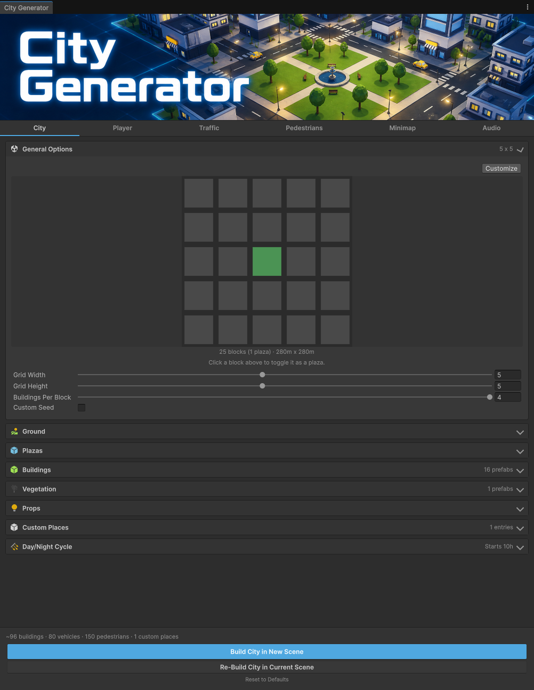

La ventana tiene cuatro partes, de arriba abajo:

| Parte | Qué es |
|---|---|
| **Banner** | La imagen de cabecera de la herramienta. Al pasar el ratón por encima muestra la versión instalada del paquete. |
| **Barra de pestañas** | Seis pestañas: City, Player, Traffic, Pedestrians, Minimap, Audio. Una pestaña cuyos ajustes contengan un error bloqueante aparece resaltada. |
| **Cards** | Los parámetros de la pestaña seleccionada, agrupados en secciones plegables. Haz clic en la cabecera de una card para plegarla/desplegarla; cada card recuerda su estado entre sesiones. |
| **Pie** | Línea de resumen, panel de validación y los tres botones de acción. |

**Badges de las cards.** A la derecha de cada cabecera hay un resumen en vivo de su contenido
(tamaño de la retícula, número de prefabs, si una funcionalidad está activa), para poder leer
la configuración sin desplegarlo todo.

**Campos obligatorios.** Los campos obligatorios *en la configuración actual* aparecen
marcados, y se ponen en rojo mientras estén vacíos. La marca es condicional: por ejemplo, el
Lawn Prefab solo es obligatorio cuando hay al menos una manzana marcada como plaza.

**Nada se aplica a tu proyecto hasta que pulsas un botón de Build.** Editar ajustes en esta
ventana nunca toca tu escena ni tus assets.

---

## 4. Pestaña City

Todo lo relativo al trazado y al contenido estático de la ciudad.

### 4.1 General Options

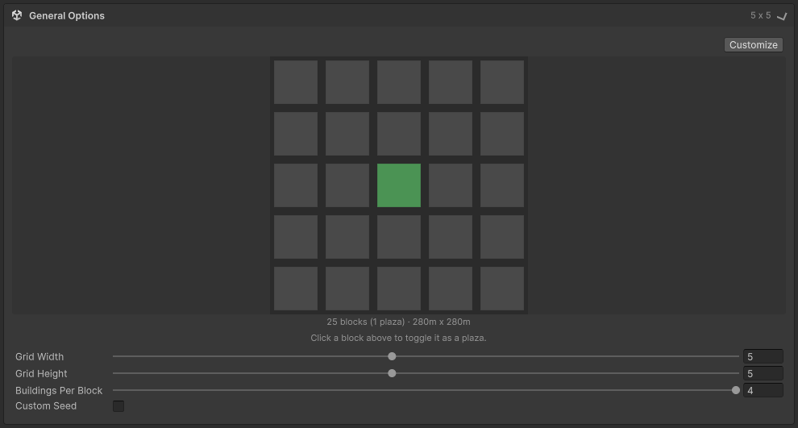

La vista previa de la retícula *es* el plano de la ciudad: cada cuadrado es una manzana. **Haz
clic en una manzana para marcarla como plaza**: una manzana-plaza recibe el layout de plaza
(césped, pieza central, bancos) en lugar de edificios, y se muestra en verde.

Bajo la vista previa, una leyenda indica el número de manzanas, cuántas son plazas y el tamaño
resultante en metros.

| Parámetro | Qué hace |
|---|---|
| **Customize** (botón, arriba a la derecha) | Cambia la vista previa al modo Custom Grid, donde dibujas a mano una forma arbitraria en lugar de un rectángulo. Ver [4.2](#42-custom-grid-modo-customize). |
| **Grid Width** | Número de manzanas en el eje X. Oculto mientras el modo Customize está activo. |
| **Grid Height** | Número de manzanas en el eje Z. Oculto mientras el modo Customize está activo. |
| **Buildings Per Block** | Cuántas de las cuatro esquinas fijas de cada manzana no-plaza reciben un edificio (0–4). Por debajo de 4, qué esquinas quedan vacías se baraja por manzana, para que la ciudad no quede uniforme. |
| **Custom Seed** | Al activarlo, la generación usa una semilla fija: los mismos ajustes producen siempre exactamente la misma ciudad (trazado, elección de prefabs, colocación). Desactivado, cada generación es distinta. |
| **Seed** | El valor de la semilla. Solo se muestra con Custom Seed activo. |

> Qué manzanas son plazas **no** forma parte de la semilla: es tu elección explícita en la
> vista previa, de modo que la ciudad generada siempre coincide con lo que muestra el plano.

Cada manzana mide 46 m, sobre un paso de 56 m (calles de 10 m), y contiene cuatro huecos de
edificio de 22 m. Son medidas fijas: tus prefabs de edificio deberían estar creados para
encajar en un hueco de 22 m.

### 4.2 Custom Grid (modo Customize)

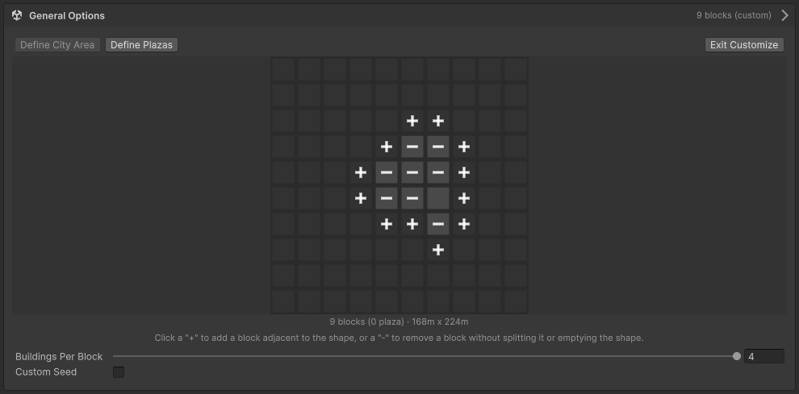

Pulsar **Customize** sustituye el rectángulo ancho × alto por una silueta dibujada a mano.
Pide confirmación primero, porque entrar en el modo **reinicia la retícula actual**: la forma
arranca de nuevo desde una única manzana central y se borra tu selección de plazas.

Aparecen dos submodos sobre la vista previa:

| Submodo | Qué haces |
|---|---|
| **Define City Area** | Dibujar la forma. Haz clic en un **+** para añadir una manzana adyacente a la forma actual; haz clic en un **−** para quitar una manzana, siempre que quitarla no parta la forma en dos ni la vacíe. |
| **Define Plazas** | El mismo clic para marcar plazas que en la retícula rectangular, pero limitado a las manzanas que existen en tu forma. |

La forma se dibuja siempre sobre un lienzo fijo de 10 × 10, y la posición en el mundo de una
manzana nunca se desplaza aunque la forma crezca o se encoja a su alrededor.

**El resultado sigue siendo un rectángulo.** Todos los huecos dentro del rectángulo envolvente
se rellenan con el **Empty Block Prefab** de la card Ground, así que una forma que abarca 6 × 8
manzanas genera una ciudad de 6 × 8 con suelo donde faltan manzanas, no un lienzo lleno de
agujeros. Y, como en el modo rectangular, la ciudad siempre termina en acera transitable, no
en asfalto pelado.

**Exit Customize** descarta la forma personalizada y restaura la retícula rectangular. Volver
a entrar en Customize siempre arranca desde una única manzana central; la forma anterior no se
recuerda.

### 4.3 Ground

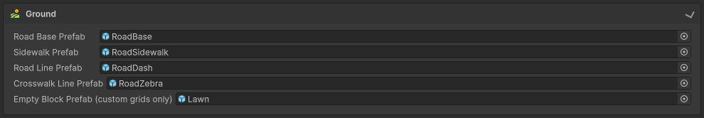

Las losas y marcas viales con las que se tesela el suelo de la ciudad. Todas son obligatorias
(la última, de forma condicional).

| Parámetro | Qué hace |
|---|---|
| **Road Base Prefab** | Losa de asfalto que cubre la calzada. Obligatorio. |
| **Sidewalk Prefab** | Losa de acera colocada alrededor de cada manzana y del contorno exterior de la ciudad. Obligatorio. |
| **Road Line Prefab** | Marca discontinua del eje de la calzada. Obligatorio. |
| **Crosswalk Line Prefab** | Franja de paso de cebra en los cruces semaforizados. Obligatorio. |
| **Empty Block Prefab (custom grids only)** | Losa de suelo que rellena cada hueco de una forma Custom Grid. Se ignora en modo rectangular; obligatorio mientras Customize está activo. |

### 4.4 Plazas

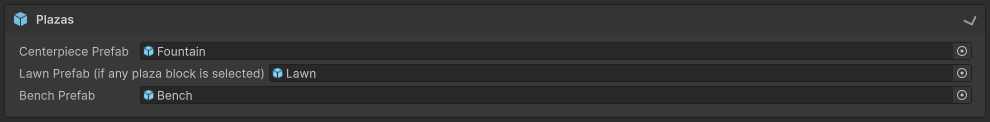

Contenido colocado en las manzanas que marcaste como plaza.

| Parámetro | Qué hace |
|---|---|
| **Centerpiece Prefab** | Opcional. Se coloca en el centro de cada plaza (la demo usa una fuente). |
| **Lawn Prefab (if any plaza block is selected)** | Losa de césped que tesela la manzana-plaza. Obligatorio en cuanto existe al menos una plaza. |
| **Bench Prefab** | Opcional. Se coloca alrededor de los cuadrantes de césped de cada plaza. |

Las plazas también reciben vegetación (ver [4.6](#46-vegetation)) y, si lo configuras, su
propia fuente de audio posicional (ver [sección 9](#9-pestaña-audio)).

### 4.5 Buildings

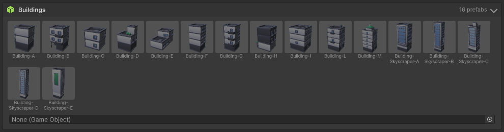

El conjunto de prefabs de edificio. Arrastra un prefab al campo inferior para añadirlo; cada
entrada se dibuja como una miniatura con una **×** para eliminarla.

Los edificios se eligen al azar de esta lista para cada esquina de cada manzana. Aquí no hay
pesos por prefab: para reparto ponderado, mira las listas de Vehicles y Pedestrians.

> Los edificios son la única categoría que **no** se comprueba contra solapamientos, ni entre
> ellos ni contra el borde de la manzana. Un prefab mayor que el hueco de 22 m se meterá
> visiblemente dentro del edificio contiguo. Dimensiona tus prefabs al hueco.

### 4.6 Vegetation

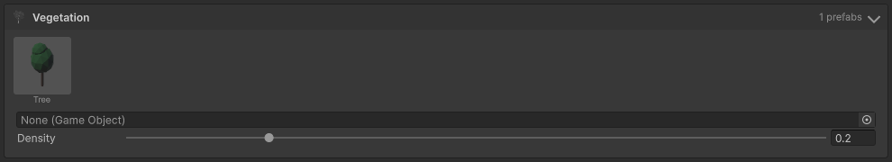

| Parámetro | Qué hace |
|---|---|
| **Prefabs** | Prefabs de árboles/plantas colocados junto a las calles y dentro de las plazas. Hace falta al menos uno cuando Density es mayor que 0. |
| **Density** | Fracción de los puntos candidatos válidos que reciben vegetación: 0 = ninguno, 1 = todos. |

Las plazas usan una fracción de esta densidad sobre su propia retícula de candidatos, mucho más
densa, para que el mismo valor no meta muchísimos más árboles dentro de una plaza que en la
calle.

### 4.7 Props

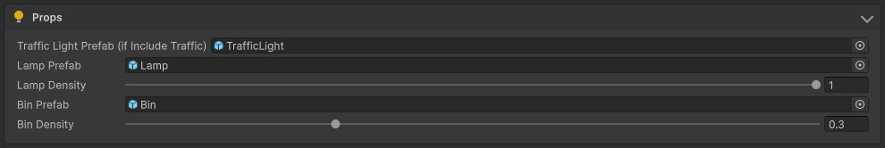

Mobiliario urbano, más el prefab de semáforo que usa la red de tráfico.

| Parámetro | Qué hace |
|---|---|
| **Traffic Light Prefab (if Include Traffic)** | Se coloca en cada cruce semaforizado. Debe llevar un componente `TrafficLight`. Obligatorio siempre que la ciudad tenga al menos un cruce interior, **incluso con los vehículos desactivados**: la red y sus semáforos se generan siempre para que los pasos de peatones estén conectados a un semáforo real. |
| **Lamp Prefab** | Farola opcional, colocada a lo largo de las aceras. |
| **Lamp Density** | Fracción de los puntos candidatos de farola ocupados en cada lado de manzana (hay 3 candidatos por lado). |
| **Bin Prefab** | Papelera opcional, colocada en las esquinas. |
| **Bin Density** | Fracción de las esquinas candidatas que reciben papelera. |

### 4.8 Custom Places

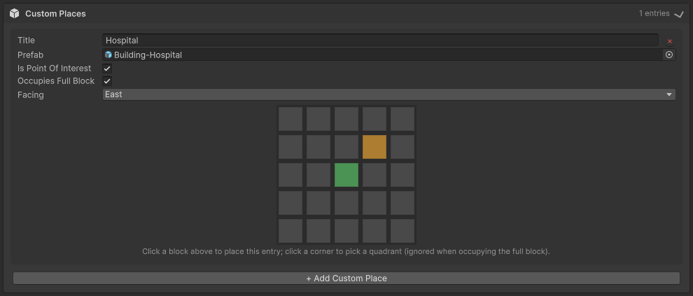

Un Custom Place es un prefab que colocas **a mano en un punto exacto**, en lugar de dejarlo a
la colocación aleatoria de edificios. Úsalo para un hito: un hospital, una comisaría, tu
edificio protagonista.

Pulsa **+ Add Custom Place** para añadir una entrada. Cada entrada tiene su propia vista previa:
haz clic en una manzana para situarla ahí, y en un cuadrante de esa manzana para elegir cuál de
las cuatro esquinas ocupa. Las manzanas-plaza se muestran en verde como referencia: un Custom
Place no puede colocarse en una.

| Parámetro | Qué hace |
|---|---|
| **Title** | Nombre de la entrada, usado en la interfaz, en los mensajes de validación y como etiqueta en el minimapa cuando es punto de interés. Obligatorio y único. |
| **Prefab** | El prefab a instanciar. Obligatorio. |
| **Is Point Of Interest** | Marca el lugar como punto de interés en el HUD del minimapa, etiquetado con su Title. |
| **Occupies Full Block** | El lugar ocupa la manzana entera (las cuatro esquinas) en vez de un único hueco de 22 m. Con esto activo, la selección de cuadrante se ignora. |
| **Facing** | Orientación fija (North / East / South / West), en pasos de 90°. A diferencia de los edificios normales, nunca se aleatoriza. |
| **×** (botón) | Elimina la entrada. |

Dos entradas no pueden reclamar el mismo hueco, y una entrada de manzana completa entra en
conflicto con cualquier otra entrada de esa manzana: ambos casos se reportan como errores
bloqueantes.

### 4.9 Day/Night Cycle

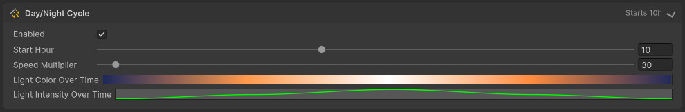

Ciclo opcional de 24 h aplicado a la luz direccional generada.

| Parámetro | Qué hace |
|---|---|
| **Enabled** | Si la luz avanza automáticamente por el ciclo en Play Mode. Desactivado, la luz simplemente se queda fija en Start Hour. |
| **Start Hour** | Hora del día (0–24) en la que arranca la luz. Se aplica **aunque el ciclo esté desactivado**, y se previsualiza en el Editor justo después de generar. |
| **Speed Multiplier** | A qué velocidad pasa el tiempo simulado respecto al real (1 = tiempo real). |
| **Light Color Over Time** | Gradiente muestreado a lo largo del día: 0 = medianoche, 0,5 = mediodía, 1 = medianoche otra vez. |
| **Light Intensity Over Time** | Curva muestreada en ese mismo rango 0–1. |

La orientación (yaw) de la luz generada se fija siempre para que el sol salga por el
este-nordeste y se ponga por el oeste-suroeste, aproximadamente alineado con la orientación del
minimapa. Tanto **Build** como **Re-Build** lo aplican, así que reconstruir una escena antigua
también corrige una orientación de sol obsoleta.

---

## 5. Pestaña Player

### 5.1 Player

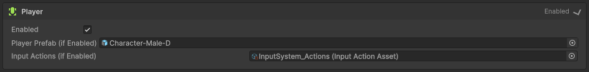

| Parámetro | Qué hace |
|---|---|
| **Enabled** | Genera un personaje controlado por el jugador. Desactivado, no se añade jugador, ni ajuste del rig de cámara, ni Free Camera. |
| **Player Prefab (if Enabled)** | El prefab del personaje. Se instancia dentro de una plaza o, si no hay, en una manzana al azar. Obligatorio con Player activo. |
| **Input Actions (if Enabled)** | El asset de Input Actions que alimenta Move/Sprint/Jump del jugador y el Look de la cámara. Obligatorio con Player activo: sin él, la cámara generada se quedaría sin input de forma silenciosa. |

La herramienta valida el asset: el action map indicado más abajo debe existir, las acciones
Move/Look deben ser de tipo Value y Jump/Sprint de tipo Button. Una errata aquí se reporta
antes de generar, en lugar de fallar en silencio en tiempo de ejecución.

### 5.2 Player Settings

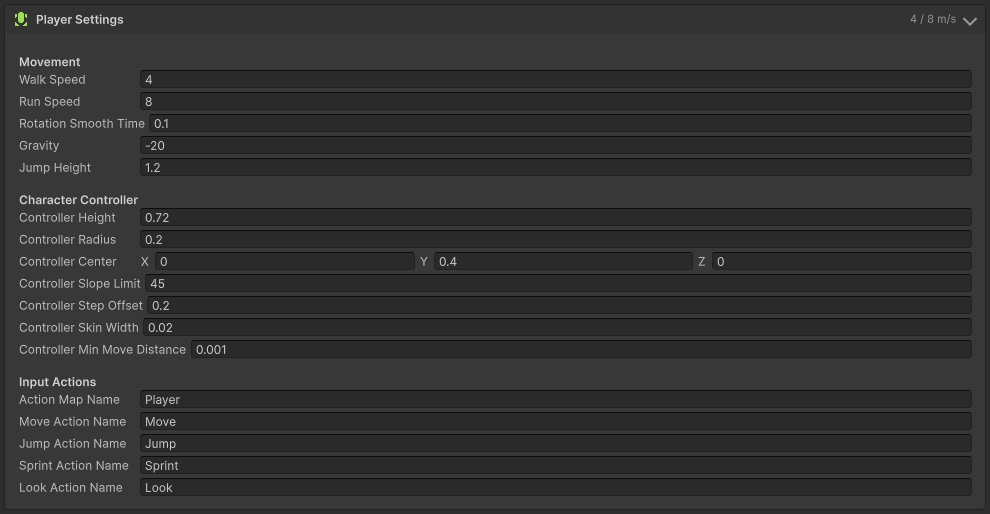

Estos valores se escriben en la **instancia generada**, nunca en tu prefab, así que son la
única fuente de verdad independientemente de lo que el prefab ya lleve configurado.

**Movement**

| Parámetro | Qué hace |
|---|---|
| **Walk Speed** | Velocidad normal de caminar, en m/s. |
| **Run Speed** | Velocidad mientras se mantiene Sprint, en m/s. |
| **Rotation Smooth Time** | Con qué rapidez el personaje gira hacia la dirección de movimiento. |
| **Gravity** | Aceleración hacia abajo mientras está en el aire. |
| **Jump Height** | Altura máxima del salto, en metros. |

**Character Controller** — se corresponden uno a uno con el `CharacterController` de Unity:

| Parámetro | Qué hace |
|---|---|
| **Controller Height** | Altura total de la cápsula. |
| **Controller Radius** | Radio de la cápsula. |
| **Controller Center** | Desplazamiento de la cápsula respecto al pivote del prefab. Ajústalo a donde estén realmente los pies de tu modelo. |
| **Controller Slope Limit** | Pendiente máxima, en grados, que el jugador puede subir. |
| **Controller Step Offset** | Escalón más alto que puede subir sin saltar. Debe ser menor que Controller Height. |
| **Controller Skin Width** | Pequeño solape que se mantiene con los obstáculos para no quedarse atascado. Debe ser menor que Controller Radius. |
| **Controller Min Move Distance** | Movimientos menores que esto se ignoran, para evitar temblores. |

> Si usas un personaje muy pequeño (un prefab tamaño mascota, un modelo escalado), recuerda que
> el Step Offset está en unidades de mundo y debe quedar por debajo de la altura de la cápsula:
> un controller configurado fuera de esos límites lo desactiva Unity en silencio.

**Input Actions** — los *nombres* que se buscan dentro del asset asignado arriba:

| Parámetro | Qué hace |
|---|---|
| **Action Map Name** | Nombre del action map que contiene las acciones del jugador. |
| **Move / Jump / Sprint Action Name** | Nombres de esas acciones dentro del map. |
| **Look Action Name** | Nombre de la acción Look, consumida por la cámara generada. |

### 5.3 Camera

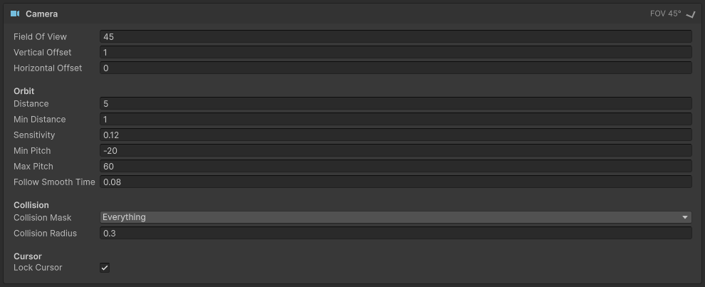

Ajustes de la cámara en tercera persona añadida a la Main Camera generada.

| Parámetro | Qué hace |
|---|---|
| **Field Of View** | FOV vertical, en grados. |
| **Vertical Offset** | A qué altura sobre el jugador se sitúa el pivote de órbita. |
| **Horizontal Offset** | Desplazamiento lateral del pivote sobre su eje derecho local (encuadre "sobre el hombro"); 0 lo mantiene centrado. |
| **Distance** | Distancia por defecto de la cámara al pivote. |
| **Min Distance** | Distancia mínima a la que puede acercarse al pivote, por ejemplo al chocar con geometría. No puede superar a Distance. |
| **Sensitivity** | Cuánto orbita la cámara por unidad de input de Look. |
| **Min Pitch / Max Pitch** | Ángulo mínimo (mirando arriba) y máximo (mirando abajo), en grados. Max debe ser mayor que Min. |
| **Follow Smooth Time** | Suaviza únicamente el seguimiento de la *posición* del jugador. |
| **Collision Mask** | Capas contra las que colisiona la cámara, acercándose al pivote en lugar de atravesar geometría. |
| **Collision Radius** | Radio de la esfera usada en esa comprobación. |
| **Lock Cursor** | Bloquea y oculta el cursor durante el juego, para que el ratón siempre orbite la cámara. |

> La **rotación** de la cámara nunca se suaviza a propósito: se probó y provocaba mareo
> perceptible. Follow Smooth Time solo afecta al seguimiento de la posición.

### 5.4 Free Camera

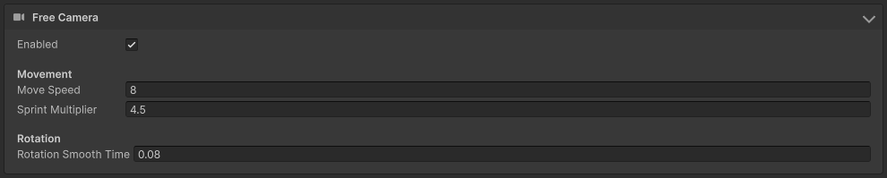

Cámara libre opcional que toma el control de la misma Main Camera en tiempo de ejecución, para
volar e inspeccionar la ciudad generada.

| Parámetro | Qué hace |
|---|---|
| **Enabled** | Añade la cámara Free View al jugador generado. Se ignora (sin error) si Player está desactivado. |
| **Move Speed** | Velocidad base de vuelo en los tres ejes, en m/s. |
| **Sprint Multiplier** | Multiplicador aplicado mientras se mantiene la acción Sprint de Free View. |
| **Rotation Smooth Time** | Suavizado del yaw/pitch al alcanzar el ángulo objetivo marcado por Look. A diferencia de la cámara en tercera persona, la Free Camera sí suaviza su propia rotación. |

Free View usa su propio action map (ver [sección 12](#12-jugar-la-ciudad-generada)); la acción
Toggle existe en ambos maps, y es lo que permite alternar entre ellos.

---

## 6. Pestaña Traffic

### 6.1 Traffic

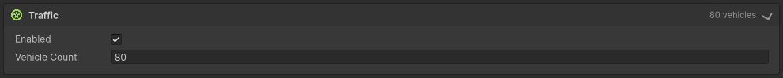

| Parámetro | Qué hace |
|---|---|
| **Enabled** | Genera la red de tráfico, sus semáforos y los vehículos. |
| **Vehicle Count** | Cuántos vehículos generar, repartidos entre la lista Vehicles por porcentaje. |

La red de tráfico y sus semáforos se generan **independientemente de este interruptor**, para
que los pasos de peatones siempre tengan un semáforo real al que obedecer. Lo que controla el
interruptor son los vehículos en sí.

Bajo Vehicle Count aparece un aviso en cuanto el número supera una fracción segura de los
puntos de aparición de la retícula. Los vehículos no planifican ruta ni evitan congestión, así
que a partir de ahí el tráfico tiende a atascarse en lugar de fluir; el mensaje te indica el
máximo recomendado para tu retícula actual. Es un aviso, no un error bloqueante.

### 6.2 Vehicles

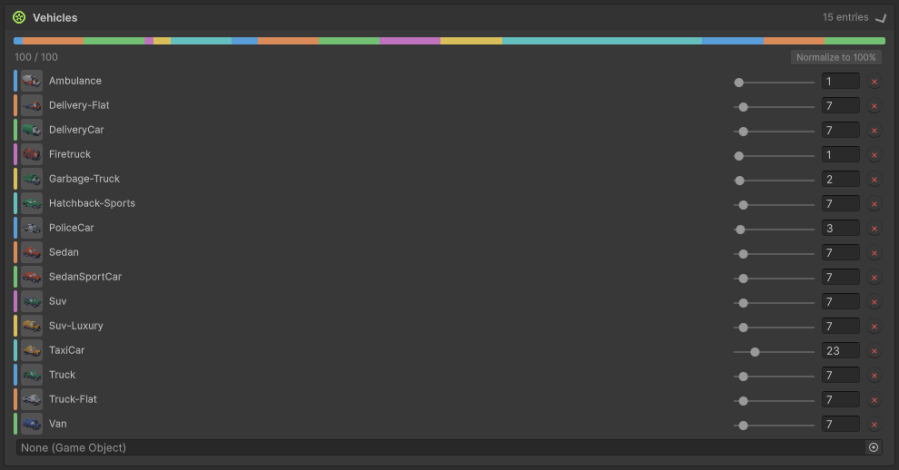

El conjunto ponderado del que se extrae el Vehicle Count. Arrastra un prefab al campo inferior
para añadirlo al 0 %.

| Control | Qué hace |
|---|---|
| **Barra apilada** (arriba) | Vista en vivo del reparto del total entre entradas. |
| **Total** (`x / 100`) | Suma de los porcentajes. Debe ser exactamente 100 para que la generación sea válida. |
| **Normalize to 100 %** | Reescala proporcionalmente todos los porcentajes no nulos hasta sumar exactamente 100. |
| **Slider / número por fila** | La parte del total de vehículos que corresponde a ese prefab. |
| **×** | Elimina la entrada. |

Los prefabs de vehículo no necesitan `Rigidbody` (se mueven por transform cada frame), y la
herramienta añade el collider que cada instancia necesita para la detección por sensores si la
raíz no tiene ninguno.

---

## 7. Pestaña Pedestrians

### 7.1 Pedestrian Settings

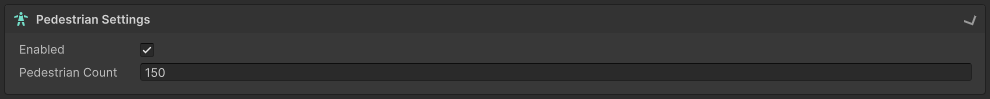

| Parámetro | Qué hace |
|---|---|
| **Enabled** | Genera peatones NPC. La red de peatones se genera siempre, independientemente de este interruptor. |
| **Pedestrian Count** | Cuántos peatones generar, repartidos entre la lista Pedestrians por porcentaje. |

Aquí pueden aparecer dos avisos no bloqueantes:

- **Saturación.** Pasada una fracción amplia de los puntos transitables del grafo, la multitud
  empieza a leerse como sobrepoblada. Los peatones nunca se atascan como los coches, así que el
  umbral es mucho más permisivo que el de vehículos.
- **Manzanas aisladas.** Una retícula 1 × N o N × 1 no tiene cruces interiores, y por tanto no
  tiene pasos de cebra ni semáforos: los peatones de cada manzana se quedan confinados en su
  propio anillo de acera, sin poder pasar a la manzana vecina.

### 7.2 Pedestrians

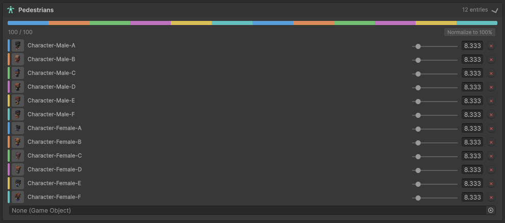

El conjunto ponderado de prefabs de peatón. Funciona exactamente igual que la lista de
Vehicles: los porcentajes deben sumar 100, con un botón **Normalize to 100 %** para ajustarlos
de un clic.

Un prefab de peatón conviene que lleve un `Animator` que consuma los parámetros
`Speed`/`Grounded` si quieres animación de caminar/parado; sin él caminan igualmente, solo que
sin animación.

### 7.3 Custom Pedestrians

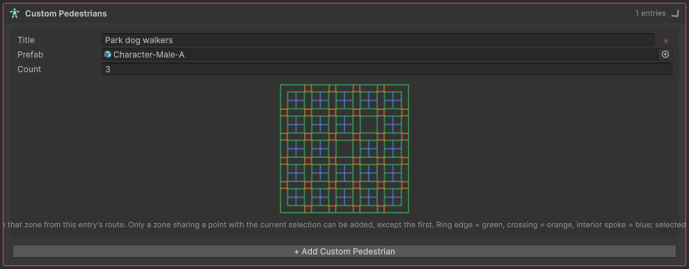

Los Custom Pedestrians son un **presupuesto aparte** de peatones confinados a una ruta que
trazas a mano, en lugar de recorrer toda la ciudad. Uso típico: un grupo de visitantes que solo
da vueltas a un parque, o una mascota que hace un recorrido fijo.

Son independientes de la card Pedestrians: se generan aunque **Pedestrian Settings > Enabled**
esté desactivado, y no cuentan para Pedestrian Count.

| Parámetro | Qué hace |
|---|---|
| **Title** | Nombre de la entrada, usado en la interfaz y en los mensajes de validación. Obligatorio. |
| **Prefab** | El prefab que se instancia en los nodos de aparición de la entrada. Obligatorio. |
| **Count** | Número de agentes de ese prefab repartidos por la ruta trazada. Mínimo 1. |
| **×** | Elimina la entrada. |

Bajo los campos, cada entrada tiene un **selector sobre el grafo de nodos**: una vista previa
del grafo peatonal real para tus ajustes actuales, con código de color — **verde** para un tramo
del anillo de acera, **naranja** para un cruce y **azul** para un radio interior que atraviesa
una manzana. Haz clic en un tramo para añadirlo a la ruta (se pone amarillo) y otra vez para
quitarlo. Solo se puede añadir un tramo que comparta un punto con la selección actual, así que
la ruta trazada siempre queda conectada.

La entrada de la captura aparece con borde rojo porque todavía no tiene ruta trazada: cada
entrada necesita **al menos dos nodos conectados** seleccionados, o la generación se bloquea. Si
cambias la retícula, las plazas o los Custom Places después de trazar una ruta, el selector
detecta que el grafo subyacente ha cambiado y te pide volver a trazarla.

### 7.4 Behaviour

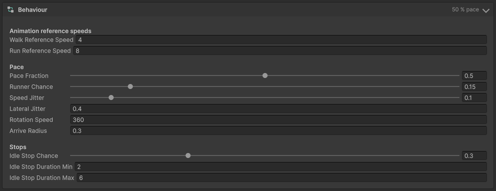

Se aplica a cada instancia de peatón generada.

**Animation reference speeds**

| Parámetro | Qué hace |
|---|---|
| **Walk Reference Speed** | Velocidad a la que el blend tree de animación alcanza su pose de caminar. |
| **Run Reference Speed** | Velocidad a la que alcanza su pose de correr. |

Estas dos son anclas de calibración, no ajustes de velocidad. Deberían coincidir con **Player
Settings > Walk Speed / Run Speed**; la card muestra un aviso mientras no coincidan, porque el
desajuste hace que los peatones patinen al andar. Ambas deben ser mayores que cero y distintas
entre sí.

**Pace**

| Parámetro | Qué hace |
|---|---|
| **Pace Fraction** | La mayoría de los peatones pasean a esta fracción de la velocidad de referencia de caminar, en lugar de al ritmo completo del jugador. |
| **Runner Chance** | Probabilidad de que un peatón sea un "corredor" y se mueva a la velocidad de referencia de correr. |
| **Speed Jitter** | Variación ± de velocidad por instancia, sorteada una vez al aparecer. |
| **Lateral Jitter** | Desplazamiento ± por instancia respecto al eje del camino, para que los que van en paralelo no vayan en fila india. |
| **Rotation Speed** | Con qué rapidez gira un peatón hacia su dirección de marcha, en grados/segundo. |
| **Arrive Radius** | Distancia a la que se considera alcanzado un nodo destino. |

**Stops**

| Parámetro | Qué hace |
|---|---|
| **Idle Stop Chance** | Probabilidad de quedarse parado al llegar a un destino, en vez de elegir otro inmediatamente. |
| **Idle Stop Duration Min / Max** | Rango de la duración aleatoria de la parada, en segundos. Max debe ser ≥ Min. |

### 7.5 Crowd

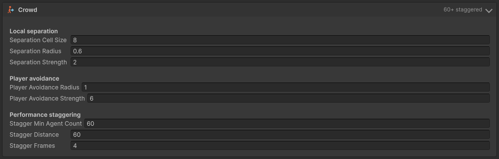

Se aplica al gestor de peatones generado: cómo se comporta la multitud en conjunto.

| Parámetro | Qué hace |
|---|---|
| **Separation Cell Size** | Tamaño de la celda de la retícula espacial usada para encontrar peatones cercanos al calcular la separación. |
| **Separation Radius** | Distancia dentro de la cual dos peatones se apartan entre sí. |
| **Separation Strength** | Intensidad de ese empuje. |
| **Player Avoidance Radius** | Distancia dentro de la cual los peatones se apartan del jugador. |
| **Player Avoidance Strength** | Intensidad de ese apartado. |
| **Stagger Min Agent Count** | Por debajo de este número de agentes, el sensor frontal de cada peatón se ejecuta cada frame. Por encima, los agentes lejanos se escalonan. |
| **Stagger Distance** | Distancia a la cámara a partir de la cual el sensor de un peatón se escalona. |
| **Stagger Frames** | El sensor de un peatón escalonado se ejecuta 1 de cada tantos frames, reutilizando el resultado anterior mientras tanto. |

Los tres parámetros de escalonado son un compromiso rendimiento/precisión: más Stagger Frames
significa multitudes más baratas y reacciones ligeramente más tardías lejos de la cámara.

---

## 8. Pestaña Minimap

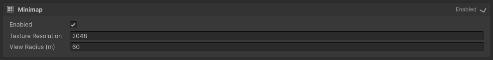

El minimapa es una instantánea cenital de la ciudad generada, guardada como PNG junto a la
escena y mostrada en juego por un HUD que sigue al jugador.

| Parámetro | Qué hace |
|---|---|
| **Enabled** | Si se genera el HUD de minimapa y se añade a la escena. |
| **Texture Resolution** | Ancho y alto, en píxeles, de la textura de la instantánea. Por encima de 4096 px aparece un aviso: una instantánea grande cuesta bastante memoria de textura y espacio en disco. |
| **View Radius (m)** | Radio, en metros, del área del mundo que el HUD muestra alrededor del jugador. Aparece un aviso si supera el área que la instantánea cubre realmente, porque el HUD nunca podría mostrar tanto. |

Los Custom Places marcados como **Is Point Of Interest** aparecen en el minimapa etiquetados
con su Title.

La instantánea se captura bajo su propia luz diurna neutra, de modo que nunca "cuece" la hora
actual del ciclo día/noche, y excluye vehículos y peatones.

---

## 9. Pestaña Audio

### 9.1 Ambience

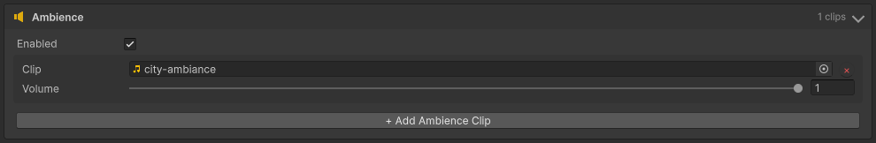

Ambiente 2D en bucle para toda la ciudad: se oye en cualquier punto, independientemente de la
posición de la cámara.

| Control | Qué hace |
|---|---|
| **Enabled** | Si suena el ambiente en la ciudad generada. |
| **+ Add Ambience Clip** | Añade una entrada. |
| **Clip** | El clip de audio de esa entrada. Obligatorio. |
| **Volume** | El volumen propio de esa entrada, independiente del resto. |
| **×** | Elimina la entrada. |

Todas las entradas suenan en bucle a la vez, cada una a su volumen, así que puedes superponer
varias capas. Dejar la card activada sin entradas —o con una entrada sin clip— es un error
bloqueante, porque no sonaría nada de forma silenciosa.

### 9.2 Plazas (audio de plaza)

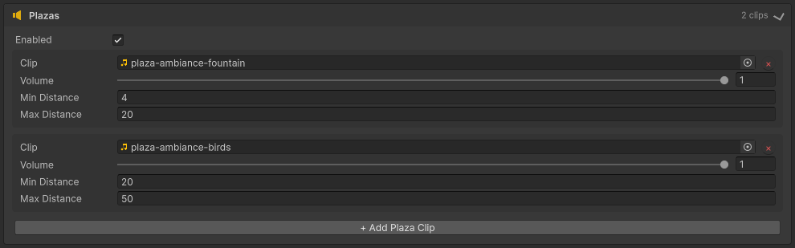

Audio 3D posicional colocado en cada plaza generada.

| Control | Qué hace |
|---|---|
| **Enabled** | Si cada plaza generada recibe su propia fuente posicional. |
| **+ Add Plaza Clip** | Añade una entrada. |
| **Clip** | El clip de audio. Obligatorio. |
| **Volume** | El volumen propio de esa entrada. |
| **Min Distance** | Distancia a la que empieza la atenuación. |
| **Max Distance** | Distancia a la que el clip deja de oírse. |
| **×** | Elimina la entrada. |

Cada entrada se crea dentro del grupo de cada manzana-plaza, así que el mismo conjunto de clips
suena en la posición de cada plaza.

---

## 10. Generar: botones, validación y avisos

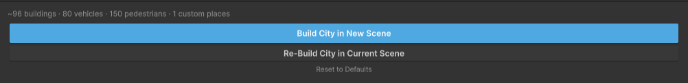

El pie, de abajo arriba:

| Elemento | Qué hace |
|---|---|
| **Build City in New Scene** | Genera una ciudad y la guarda como la siguiente `Assets/Scenes/City<N>.unity` libre. La escena que tuvieras abierta no se toca. |
| **Re-Build City in Current Scene** | Borra el objeto `City` de la escena actual y lo regenera con los ajustes actuales. Pide confirmación primero. |
| **Reset to Defaults** | Descarta todos los cambios y restaura los valores por defecto de la herramienta. |
| **Línea de resumen** | Estimación en vivo de lo que se va a generar: edificios, vehículos, peatones, custom places. |
| **Panel de validación** | Todos los problemas encontrados en los ajustes actuales, en vivo. |

**Qué conserva Re-Build.** La cámara y el jugador quedan intactos. La luz direccional conserva
su posición y ajustes de sombra, pero se corrige su orientación y se actualiza su ciclo
día/noche según los ajustes actuales. Si la generación falla a medias, la ciudad anterior se
mantiene intacta: la reconstrucción es transaccional.

**Errores bloqueantes frente a avisos.** Ambos se listan en el panel de validación; la pestaña
y la card que contienen el problema se resaltan para que lo encuentres. Los errores deshabilitan
los dos botones de Build (el tooltip del botón indica cuántos problemas quedan). Los avisos
nunca bloquean la generación: señalan una consecuencia que quizá no esperes, como una densidad
de tráfico propensa al atasco, una textura de minimapa desproporcionada o un prefab sin
`Renderer` cuya huella no se puede medir.

**Durante la generación** una barra de progreso indica cada fase. Al terminar aparece un panel
de resultado sobre los botones con la ruta de la escena y los recuentos reales de lo generado,
más un botón **Ping Scene** que resalta el asset de la escena en la ventana Project. El mismo
resumen se escribe en la consola.

Errores bloqueantes habituales y su solución:

| Mensaje | Solución |
|---|---|
| *Ground: … prefab is required* | Asigna el prefab que falta en la card Ground. |
| *Ground: Empty Block prefab is required while Customize mode is on* | Asígnalo, o sal del modo Customize. |
| *Plaza: Lawn prefab is required when at least one plaza cell is selected* | Asigna un Lawn Prefab, o desmarca las manzanas-plaza. |
| *Props: Traffic Light prefab is required…* / *…must have a TrafficLight component* | Asigna un prefab que lleve el componente `TrafficLight`. |
| *Vehicles / Pedestrians: percentages must sum to 100* | Pulsa **Normalize to 100 %**. |
| *Player: Player Prefab / Input Actions is required when Player is enabled* | Asígnalos, o desactiva la card Player. |
| *General: … action was not found in the … action map* | Corrige el nombre de la acción en Player Settings > Input Actions, o el propio asset. |
| *Custom Places: … has no position assigned yet* | Haz clic en una manzana (y en un cuadrante) en la vista previa de esa entrada. |
| *Custom Pedestrians: … needs at least 2 connected nodes* | Traza una ruta en el selector de grafo de esa entrada. |
| *Audio: … is enabled but has no clip entries* | Añade un clip, o desactiva esa card de audio. |

---

## 11. Qué acaba en tu escena

La generación crea un único objeto raíz llamado **`City`**, con un grupo por tipo de contenido:

`Roads`, `EmptyBlocks`, `Sidewalks`, `RoadMarkings`, `CustomPlaces`, `Buildings`,
`TrafficLights`, `StreetLights`, `Plaza`, `Trees`, `Props`, `Vehicles`, `TrafficNetwork`,
`Pedestrians`, `PedestrianNetwork`.

Junto a él, una escena nueva recibe además una `Directional Light`, una `Main Camera` (con el
controlador de tercera persona y, si está activada, el de Free Camera), el `Player` y el HUD del
minimapa.

Todo salvo `Vehicles` y `Pedestrians` queda marcado como estático para batching y occlusion, de
modo que los bakes de iluminación y occlusion están listos para lanzarse — la herramienta
simplemente no los lanza por ti.

---

## 12. Jugar la ciudad generada

Los controles vienen del asset de Input Actions que asignaste, así que las teclas exactas son
cosa tuya. Con el asset de demostración:

| Acción | Binding por defecto | Qué hace |
|---|---|---|
| Move | WASD / stick izquierdo | Caminar |
| Sprint | Mayús izquierdo | Correr |
| Jump | Espacio | Saltar |
| Look | Ratón / stick derecho | Orbitar la cámara |
| Toggle | La acción Toggle en ambos maps | Alternar entre la cámara en tercera persona y Free View |

En **Free View**, Move vuela en horizontal, la acción Vertical (Q/E en el asset de
demostración) sube y baja, y Sprint multiplica la velocidad de vuelo.

---

## 13. Después de generar

Hay algunas cosas que se dejan deliberadamente en tu mano, por escena generada:

- **Hacer el bake de lightmaps y occlusion culling.** La geometría ya está marcada para ambos.
- **Añadir `LODGroup`s** a tus propios prefabs si generas una ciudad grande.
- **Ajustar la iluminación a tu gusto.** La escena sale con una única luz direccional y sin
  volumen de post-proceso, para no depender de un render pipeline concreto.

**Tools > City Generator > Rebuild Pedestrian Network** recalcula el grafo de peatones contra la
escena tal y como está, sin regenerar la ciudad. Úsalo después de mover o añadir un obstáculo a
mano. La misma reparación se ejecuta automáticamente cada vez que entras en Play.

> Ten en cuenta que un obstáculo para peatones se detecta puramente por física: un objeto **sin
> `Collider`** en ninguna parte de su jerarquía nunca bloquea a los peatones, y lo atravesarán.
> Si algo que has colocado debería bloquearlos, dale un `Collider`.

Y por último: **los arreglos van en la herramienta, no en la escena.** Editar a mano una escena
generada arregla exactamente una ciudad y se pierde en la siguiente generación.

---

## 14. Resolución de problemas

| Síntoma | Causa probable |
|---|---|
| **Los dos botones de Build están deshabilitados** | Hay al menos un error bloqueante; el panel de validación justo encima lo enumera, y la pestaña/card que lo contiene aparece resaltada. |
| **Todo se ve en magenta** | Los materiales de demostración son URP/Lit. Con Built-in o HDRP tienes que aportar tus propios materiales: la herramienta en sí no depende de ningún pipeline. |
| **Un edificio se mete dentro del contiguo** | Los edificios no se comprueban contra solapamientos. Dimensiona tus prefabs al hueco de esquina de 22 m. |
| **El tráfico está parado en todas partes** | Vehicle Count es demasiado alto para la retícula; el aviso bajo el campo indica el máximo recomendado. |
| **Los peatones no pueden cruzar la calle** | La retícula es 1 × N o N × 1, que no tiene cruces y por tanto no tiene pasos de cebra. |
| **Los peatones atraviesan un objeto** | No tiene `Collider` en ninguna parte de su jerarquía. Dale uno y reconstruye la red de peatones. |
| **Los vehículos no se detectan entre sí ni a los peatones** | Todas las capas de tu proyecto están ocupadas y no se han podido crear las capas `Vehicle`/`Pedestrian`. La consola lo indica. Libera una capa. |
| **Los peatones patinan al andar** | Walk/Run Reference Speed ya no coinciden con Player Settings > Walk/Run Speed; la card Behaviour lo avisa. |
| **La animación de un peatón se queda congelada** | Su rig no está skinneado, o sus clips de locomoción no están en bucle. Consulta los requisitos de peatones en el [README](../README.es.md). |
| **Quiero exactamente la misma ciudad otra vez** | Activa **Custom Seed** y conserva el valor de la semilla. |
